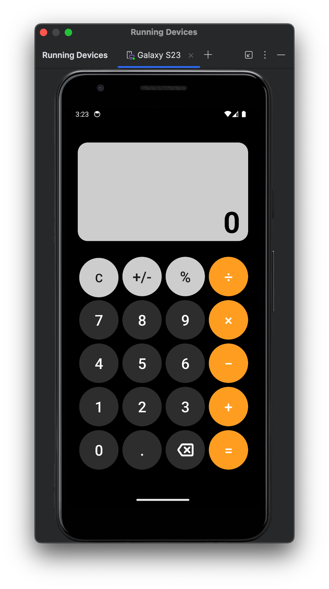

<h1 align="center">Simple Easy Calculator 📱</h1>

## Project 🎯 

Exercise 04: This application provides a practical and intuitive way to perform calculations, allowing users to enter mathematical expressions and obtain results quickly and efficiently.

## Layout 🎨 

<div align="center">
  
</div>

## Technologies Used 🤖🍏

- **Programming Language:** Kotlin
- **Development Environment:** Android Studio

## Code Author 💻👨‍💻

```kotlin
fun main() {
    println("Code by Júnio Moreira!")
    println("Welcome to the Simple Easy Calculator!")
}
